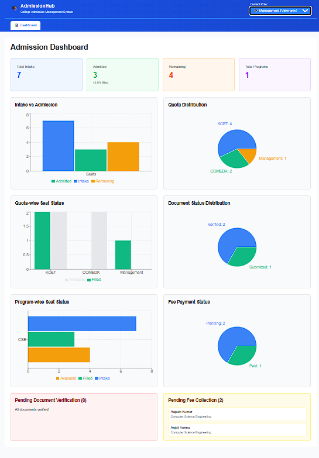
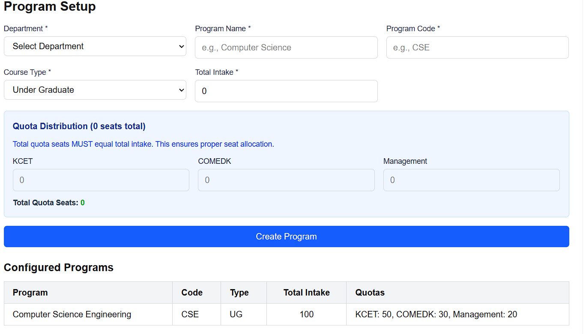
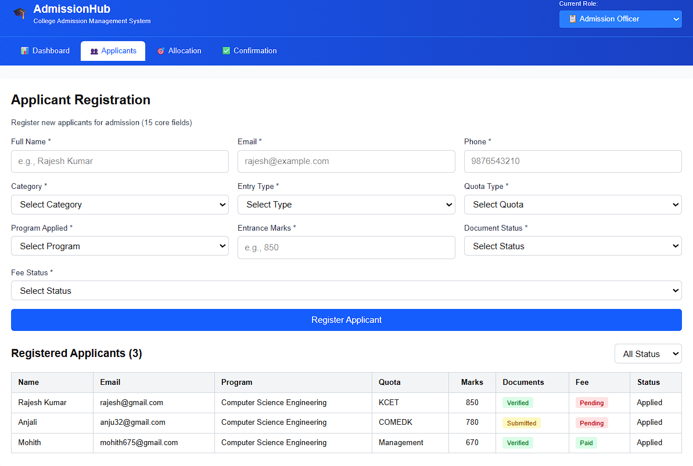
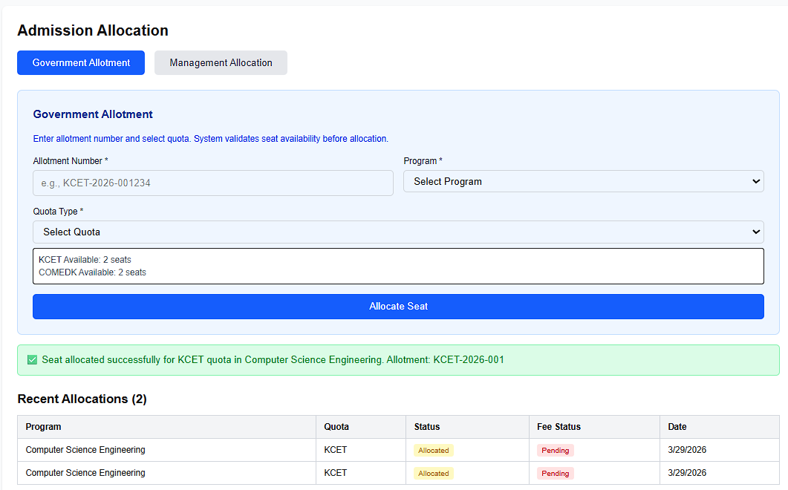
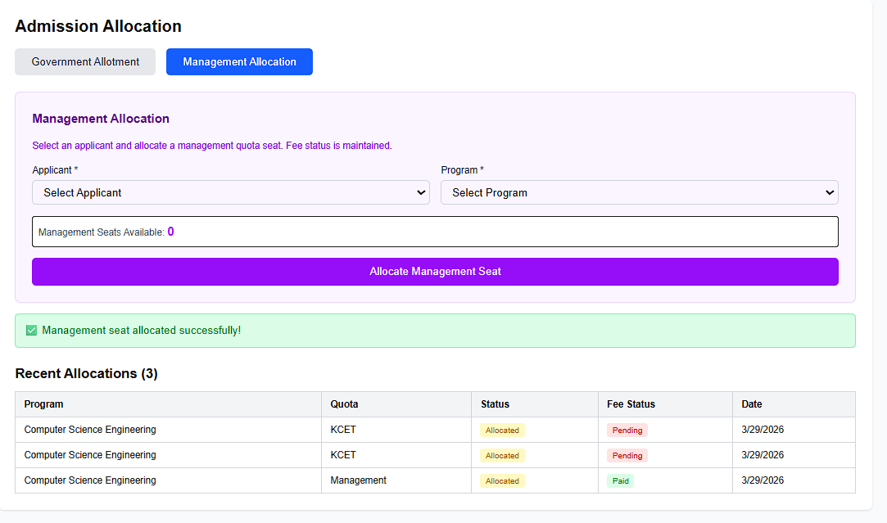
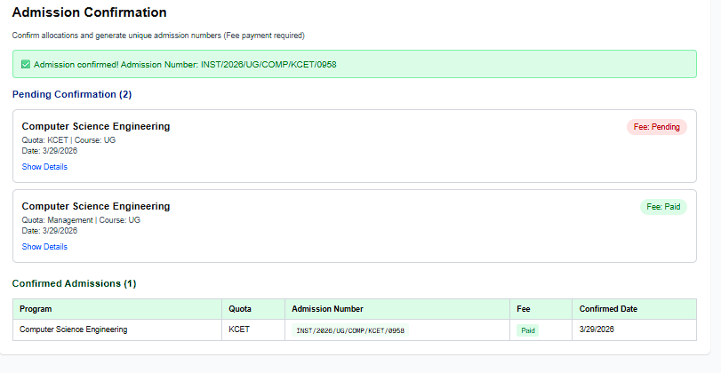

# AdmissionHub: College Admission Management & CRM System

A production-inspired **Admission Management System** built with Next.js, TypeScript, and Tailwind CSS.
Designed to demonstrate clean architecture, business logic, and real-world admission workflows.

---

## 🎯 Overview

This system enables colleges to:

- Configure programs and quotas
- Manage applicants and documents
- Allocate seats without violating quota rules
- Generate unique admission numbers
- Track fee and admission status
- Monitor progress via dashboards

---

## ✨ Key Features

### 1. Master Setup

- Institution, Campus, Department, Program hierarchy
- Academic year configuration
- Quota distribution validation (total quota = intake)

---

### 2. Seat Matrix Logic

- Real-time seat tracking per quota
- Prevents over-allocation
- Constant-time validation:

```ts
if (filledSeats[quota] < quotas[quota]) {
  allow allocation
}
```

---

### 3. Applicant Management

- Registration form (≤15 fields)
- Category, quota, marks tracking
- Document status:
  - Pending
  - Submitted
  - Verified

---

### 4. Admission Allocation

#### Government Flow

- Allotment number entry
- Quota selection (KCET / COMEDK)
- Seat availability validation

#### Management Flow

- Manual applicant creation
- Direct allocation to management quota

---

### 5. Admission Confirmation

- Unique, immutable admission numbers
- Format:

```
INST/2026/UG/CSE/KCET/0001
```

- Confirmation allowed only when:
  - Fee status = Paid

---

### 6. Dashboard

Includes 6 interactive charts:

- Intake vs Admitted (Bar)
- Quota Distribution (Pie)
- Seat Status (Bar)
- Program Performance (Horizontal Bar)
- Document Status (Pie)
- Fee Status (Pie)

Also shows:

- Pending documents
- Pending fee list

---

### 7. Role-Based Access

| Role              | Access                               |
| ----------------- | ------------------------------------ |
| Admin             | Full system access                   |
| Admission Officer | Applicants, Allocation, Confirmation |
| Management        | Dashboard (view-only)                |

---

## 📸 Application Preview

### 📊 Dashboard

Shows real-time admission statistics, quota distribution, and pending actions.



---

### ⚙️ Master Setup (Program & Quotas)

Configure program intake and quota distribution with validation.



---

### 👥 Applicant Registration

Register applicants and track their status across the admission lifecycle.



---

### 🎯 Seat Allocation

Allocate seats through Government and Management flows with quota validation.




---

### ✅ Admission Confirmation

Generate unique admission numbers after fee payment and finalize admission.




## 🏗️ Architecture

### Folder Structure

```
app/
├── components/        # UI components
├── services/          # Data layer & global state
├── utils/             # Business logic & validation
├── types/             # TypeScript interfaces
└── dashboard/         # Analytics UI
```

---

### Data Flow

```
User Input
   ↓
React Hook Form
   ↓
Zod Validation
   ↓
Business Logic (utils)
   ↓
Mock Database (services)
   ↓
State Update
   ↓
UI Refresh
```

---

## 🔑 Core Algorithms

### Seat Allocation

```ts
function canAllocateSeat(program, quotaName) {
  return program.filledSeats[quotaName] < program.quotas[quotaName];
}

function allocateSeat(program, quotaName) {
  if (!canAllocateSeat(program, quotaName)) {
    return { success: false };
  }
  program.filledSeats[quotaName]++;
  return { success: true };
}
```

---

### Admission Number Generation

- Format:

```
INSTITUTION/YEAR/COURSE/PROGRAM/QUOTA/SERIAL
```

- Properties:
  - Unique
  - Immutable
  - Generated only once (at confirmation)

---

### Quota Validation

```ts
Total Quota Seats === Program Intake
```

Prevents:

- Over-allocation
- Missing seats

---

## 🚀 Tech Stack

- Next.js (App Router)
- TypeScript (strict mode)
- Tailwind CSS
- React Hook Form
- Zod (validation)
- Recharts (data visualization)
- React Context (state management)

---

## 🎮 Quick Start

```bash
npm install
npm run dev
```

Open:

```
http://localhost:3000
```

---

## 🧪 Usage Flow

1. Create Institution
2. Create Campus
3. Create Department
4. Create Program (with quotas)
5. Register Applicant
6. Allocate Seat
7. Mark Fee as Paid
8. Confirm Admission
9. View Dashboard

---

## 🧪 Test Scenarios

| Scenario                   | Expected Result |
| -------------------------- | --------------- |
| Allocate seat within quota | ✅ Success      |
| Exceed quota limit         | ❌ Blocked      |
| Confirm without fee        | ❌ Not allowed  |
| Switch to management role  | Dashboard only  |

---

## 📚 Detailed Documentation

For complete architecture and logic explanation:

👉 See: `CODEBASE_EXPLANATION.md`

---

## 🤖 AI Assistance

This project was developed with assistance from:

- GitHub Copilot
- ChatGPT

Used for:

- Component scaffolding
- Code structuring
- Documentation support

All core business logic (seat allocation, quota validation, admission flow) was implemented and fully understood by me.

---

## ⚠️ Assumptions

- Data is stored in-memory (mock database)
- No authentication (role-based UI simulated)
- Admission number uniqueness ensured within session
- Designed for demo/interview purposes

---

## 🚀 Future Improvements

- Backend integration (Node.js / PostgreSQL)
- Authentication & authorization (JWT)
- Persistent database storage
- Pagination for large datasets
- Real-time updates (WebSockets)

---

## 📈 Project Stats

- 10+ components
- 50+ service functions
- 20+ TypeScript types
- 2500+ lines of code
- 6 data visualizations

---

## 🏁 Conclusion

This project demonstrates:

- Clean architecture
- Strong business logic implementation
- Real-world system design
- Scalable and maintainable code structure

---
